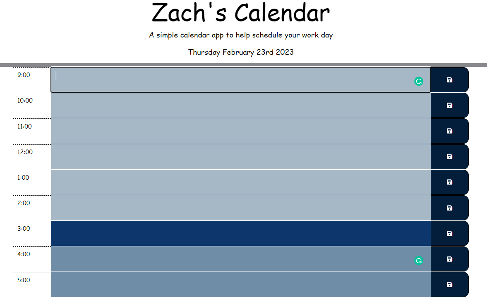
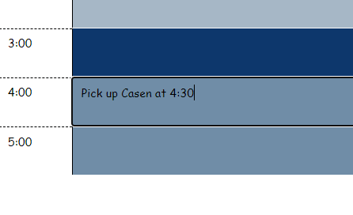

# Zach's Calendar

#### By Zach Hanson 
in collaboration with UTSA

#### Purpose
This application Makes it easy to view every hour of the buisness day and add events to the calendar. All events are saved locally and are there for you when you come back to it.

## Usage

1. Open the Calendar in any browser
2. Add events to the calendar and save them in local storage for future use
3. Calendar displays current hour and date

## Technologies Used

HTML, 
CSS,
JavaScript
JQuery
JQueryAI
Google Fonts
FontAwesome.com
cloudflare.com

## Credits
starter code pulled from: https://utsa.bootcampcontent.com/utsa-bootcamp/UTSA-VIRT-FSF-PT-01-2023-U-LOLC.git

## website
Check it out for yourself! https://zachitp.github.io/Zach-s-Calendar/

## Support
 

## License
MIT Copyright (c) Zach Hanson

Permission is hereby granted, free of charge, to any person obtaining a copy of this software and associated documentation files (the "Software"), to deal in the Software without restriction, including without limitation the rights to use, copy, modify, merge, publish, distribute, sublicense, and/or sell copies of the Software, and to permit persons to whom the Software is furnished to do so, subject to the following conditions:

The above copyright notice and this permission notice shall be included in all copies or substantial portions of the Software.

THE SOFTWARE IS PROVIDED "AS IS", WITHOUT WARRANTY OF ANY KIND, EXPRESS OR IMPLIED, INCLUDING BUT NOT LIMITED TO THE WARRANTIES OF MERCHANTABILITY, FITNESS FOR A PARTICULAR PURPOSE AND NONINFRINGEMENT. IN NO EVENT SHALL THE AUTHORS OR COPYRIGHT HOLDERS BE LIABLE FOR ANY CLAIM, DAMAGES OR OTHER LIABILITY, WHETHER IN AN ACTION OF CONTRACT, TORT OR OTHERWISE, ARISING FROM, OUT OF OR IN CONNECTION WITH THE SOFTWARE OR THE USE OR OTHER DEALINGS IN THE SOFTWARE.